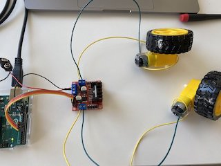
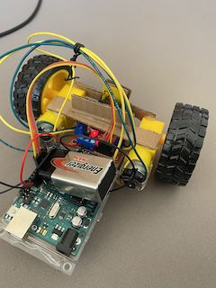
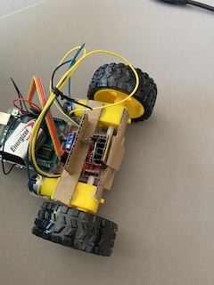
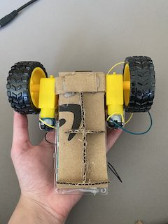

# Project Documentation

## September 20

### My Definition of Robot

To me, a robot is simply defined as a machine that carries out, or has, certain functions. A robot can vary in the way it looks physically, but at the end of the day, the mechanics of what makes a robot are similar among all platforms. It should be something that eventually runs with no human intervention, regardless of whether it is a human-like robot or one that resembles the basic metallic figure we usually picture. 

### My Process

#### What is my Project?

I want to start by saying that building a robot is something that I have never done previously so getting to finaly work on one this week was extremely exciting. That being said, my project is a very basic interpretation of what a robot is. I simply developed a robot using two motors and a set of wheels and I coded it to move in specific directions. The sequence I decided to implement was rather basic, where I had the robot change directions between moving forward or backwards every 1.5 seconds... I tried to work on something more complex but I unfortunately did not have the time over the weekend to complete it. 
[Here](https://drive.google.com/file/d/19BiO08T4OELrG5__X_tIiPfssOuXIber/view?usp=sharing) is a video of the final process and below I will break down how I reached this point. 


#### The Different Stages

##### Step 1:

When starting the project, I simply started by making sure the motors worked correctly, specifically with the wheels attached. First I worked on code for just one motor...


I then attached the second motor and made sure that the two motors worked properly when functioning simultaneously.



##### Step 2:

Once I made sure the mechanics of the project worked correctly, I began to assemble the robot's support using some cardboard and a glue gun. At first it began with creating a base in between the two motors. As I continue to work on the project, I realized that I was adding more pieces of cardboard in specific areas as I realized that the base I had at the start was not going to be supportive enough.

It started with simple support:

 

And then grew to look something more like this:

  

##### Step 3:

Next I made sure that the robot still ran smoothly with all the cardboard support it had. After a few test runs and cutting off cardboard when it was getting in the way of the robot running smoothly, I had a functioning robot with a functioning sequence.

Find the video [here](https://drive.google.com/file/d/1UqLwDoWqjG7uStEcU3vwNZz3YsDPxlT5/view?usp=sharing).

##### Step 4:

After I had a product that was properly functioning, I decided to mess around and tweak certain codes. At the start, the robot was simply running as such:

````
  digitalWrite (in1Pin, HIGH);
  digitalWrite (in2Pin, LOW);
````

This meant that whenever the motors switched on and off, it was at a fixed speed. The speed that it was at was actually quite annoying since it was moving way too quick. As a result, I switched the pins the motors were connected on the Arduino to PWM pins so that I could control the speed. The code then looked similar to this:

````
  analogWrite (in1Pin, 150);
  analogWrite (in2Pin, LOW);
````

That way I had control over the speed and I could put it at a pace that I found more interesting. 

#### Difficulties

There are actually quite a few issue I ran into when working on this project:

1. The way I initially had the cardboard support was actually affecting the way my robot was moving. The cardboard was a bit too wide in certain areas which made it rub against the floor when it was running which affected it majorly. In addition to that, at some point the cardboard did not allow the wheels of the robot to touching the floor at all which was a problem... These were all simple issue fixed by cutting specific cardboard areas.
2. The next thing had to do with the way I assembled the robot. There were different parts that went into the functioning of this robot, and the way in which their weight was distributed affected the way the robot functioned. Again, a simple issue that was fixed by distributing the weight in a way that made more sense and that allowed the robot to work more effeciently. 

When it came to the actual coding and the technical aspects of the project, I did not run into any major issue. Just a few silly mistakes here and there. The main aspect I struggled with was the assembling of the robot, as I mentioned above, as it is something that I had not previously done, so trying to navigate that proved to be slightly difficult. Regardless, I overcame those struggles and was able to finally achieve what I wanted.

