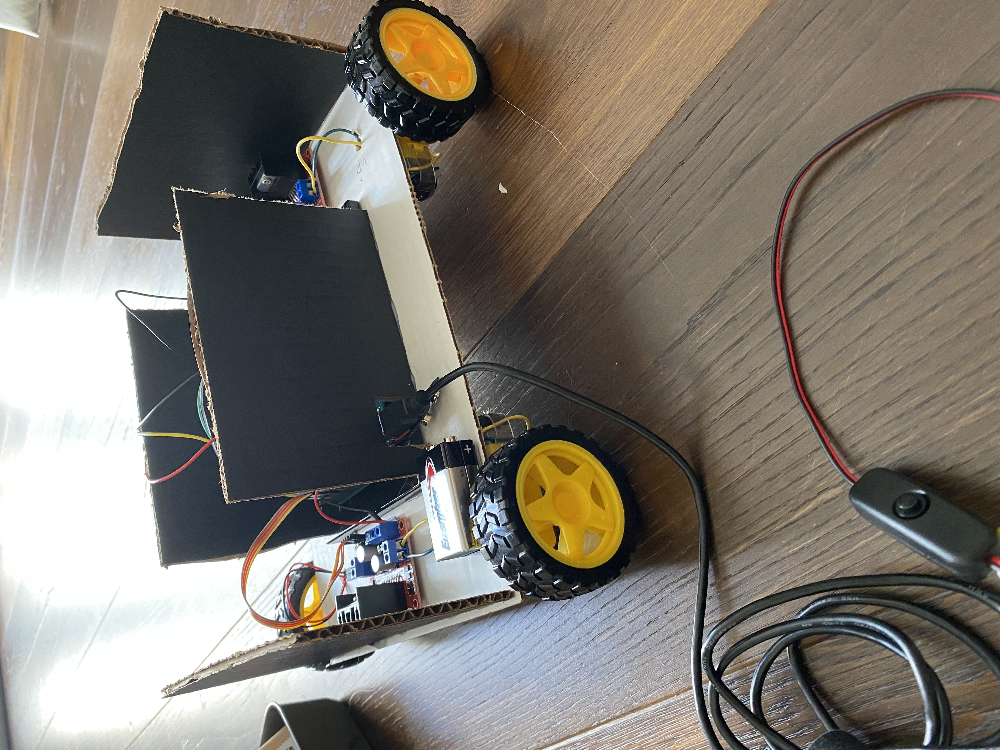

# Midterm Project

## Project Documentation

Please see my journal [here](https://github.com/AalyaSharaf/PerformingRobots/blob/main/midtermProject/journal.md) for a more detailed description of my process...

## Project Description

For my midterm project, I built a remote controlled "dog" named Rex. The main aim of this project, for me, was to work on radio communication since it was a concept that was new & interesting to me. Rex is broken down into two parts: The controller that consists of buttons that indicate specific direction of motions & the physical robot that is being controled by the remote.

## Project Stages

To further explain how Rex came to be, I will break down the building process

### Stage 1: The Mechanics

To start, I began on working the mechanical parts of my project: I figured out what parts I wanted and I wired up everything I needed to. Basically, I just made sure all my components were working well. I did this by separately testing each component with specific Arduino code examples... This was just so I could avoid furhter complications or errors (that come as a result of faulty hardware) in the future.

### Stage 2: The Code

Next, was making sure that all those isolated pieces, worked well collectively. This part took more time as figuring out what code went where was a bit more complicated.

Here is an example of the code being used in this project:

### Stage 3: The Assembly

Finally, it was time to assemble Rex. I had all the components working but now I needed a more physical and structured manifestation of Rex. 

  

## Struggles & Difficulties
1. idjsfjds
2. ksdfhsdf
3. khadflsdh
4. sdhfksdjhf
5. ljhsadfljsahdf

### Again, this is a very simplified and refined version of how Rex was developed, so please refer to the link at the top of the page for a more detailed and realistic look into the process. 
