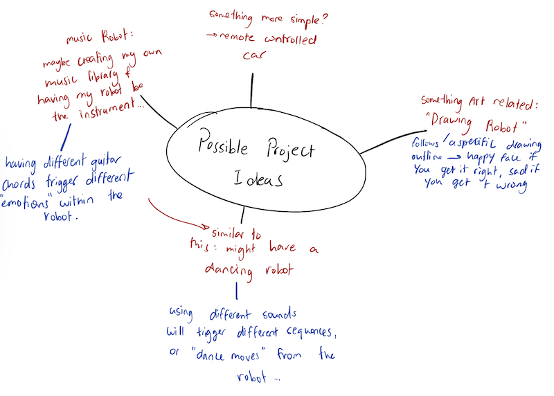
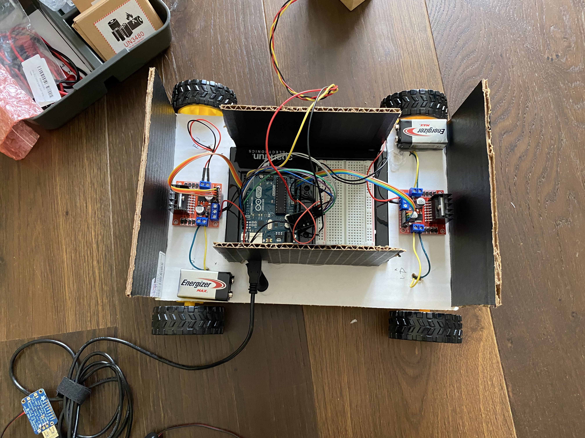
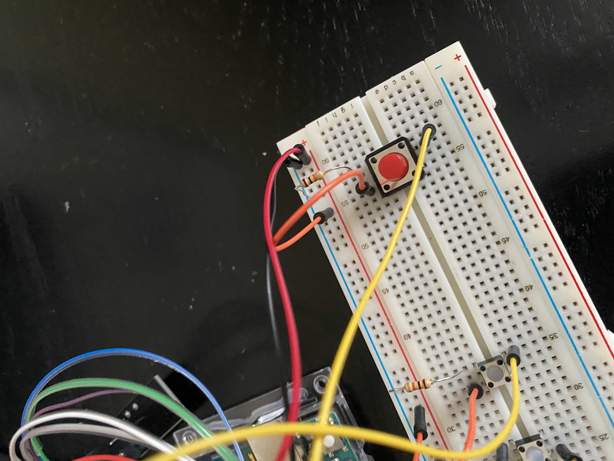

# Midterm Project

## October 1, 2021

### Brainstorming Project Ideas:

This is the first day that I am working on this project, so I decided to start off with a simple brainstorm. These are just a few of the ideas that came to mind, but I am not too sure that they are the ideas that I am going to stick with... 

## October 3, 2021

I unfortunately did not have much time over the weekend to work on the physical aspect of the project, but I was able to narrow down my idea to just one. What I want to have is four buttons, each of which correspond to a sequence of movements within my robot. A sequence could include an arm rotating a certain direction, or maybe even a "dance" sequence of sorts. I also want to include sound in my project, if possible, as I am not too sure how that could be incorporated. 

## October 4 & 5, 2021

I started to more specifically plan what parts I wanted to use in my project (things like what motors I want to use...) and I created a more "visual" idea of what I want my project to look at. I decided on a few motors with wheels attached in order to have a mobile robot. I also relaly like the idea of having a neoPixel that kind of gives the robot the illusion of life with all the flashy and vibrant colors of the light. Another idea I had was an external remote control using the joystick. We did not really go over it in class but hopefully coding it isn ot too complicated. Drawing was never my strong suit but below are a few sketches I had. Be warned, it gets a bit messy...

Besides that, I started working on the seperate components and seeing if they worked individually, but I was not able to wire and code them together yet. I feel like that is where it is going to start getting cmplicated... I am also still trying to figure out how I am going to assemble all the components in a way that allows it to work the most effeciently. Another concern I had was whether or not I am going to be able to fit all of the components onto one arduino... Hopefully after a bit of experimentation, all will be cleared up. 

## October 7, 2021

Today was an extremely productive day!!! I was able to see how each of the separate components, that I had tested out earlier, would come together. 

1. My plan was to have the neopixel be the face of my robot, so I wanted it to be as expressive as possible. I began today by working on creating functions that would contain the different emotions the robot would have... I only created two: a happy one, and a sad one. To test that the expressions would be expressed correctly if triggered by a certain event, I hooked up a button. I made it so when the button is pressed, the happy face is shown, otherwise it is the sad face that is shown. That was just to test that the transition between the two faces was smooth. 

2. The second thing I did was wire up all the buttons I wanted to use. I decided to use 3 buttons that would control the robot: one to go forward, one to go left, and one to go right. At some point Initially, I wanted to have one button to control going forward and then a potentiometer to control going left and right, but I realized that I did not like the way the user would have to use the remote. It was a bit of a hassle and I did not feel it would make for the best user experience, so I scrapped the idea and added an extra 2 buttons instead. 

3. I knew I wanted to use a radio connection between my remote and my robot. I was able to go over the example we used in class and I hooked up my radios accordingly. Thankfully, I did not run into any problems as I had done this once previously. Next, I connected 2 of the motors I had to an H-bridge. Again, this went over smoothly as I had done this before. Once that was done, I uploaded the code we used to class onto each of my arduinos and it was working great!

4. At this stage, I started running into more trouble. The example we used in class was to trigger 1 H-bridge with 2 motors attached. What I wanted to do, was have 4 motors attached. At first, I was going to try to connect 4 of my motors to one H-bridge. It is something that I had watched multiple videos on and found it would be more practical in the end. Unfortunately, I found that one of my motors had a broken copper tab. With that being said, I felt as though I had limited resources (since I was working in Dubai and had no access to the lab), and I did not want to risk ruining another motor. As a result, I decided to hook up 2 motors to a second H-bridge, and strated working form there.

5. I was worried about how I was going to change certain aspects of the code. I decided to make a copy of the class example, one I could experiment with. I began by studying the code and trying my best to understand it. I quickly realized that a large part of the way the code made the motors work depended on Analog or PWM pins. Since I did not much space left on my arduine, I decided to hook up my 2 new motors onto the analog pins since they could be used as both digital and analog pins. That ended up helping me a lot when it came to getting the motors to work. 

6. Next, I wanted to make the motor more mobile, meaning I wanted to comeplely get rid of its dependence on a computer, so I connected it to a powerboost. I actually intially connected the powerboost the my remote control (the arduino with the buttons), then quickly realized that it was the robot I wanted to be mobile, not the remote... I realize that I could connect a second powerboost if I wanted it, but I am content with how it is right now, seeing as the remote being mobile is not a completely necessary. I may change it in the upcoming days if I feel like it may need it. Here is what it currently looks like:

7. I wanted to point out a really silly mistake I made that cause a majot amount of chaos for me when connecting the powerboost. At this stage, I had forgotten that despite the arduino working while being connected to the powerboost, I could not upload code that way. This being said, whenever I would make changes to the code, I would confuse which arduino was connected to what wire, which led to a lot of "debugging" on my end. I put it in quotation because there was nothing actually wrong with the code, or even the wiring, but rather a forgetful mistake on my end. It seems funny looking back now, but it actually took me a good hour of trying to figureout what was wrong before realizing that I just uploaded the wrong code to each of the arduinos. It was a long process to say the least... 

8. Once I figured out my mistake, and successfully uploaded the CORRECT code to each of the arduinos, I had 4 functioning motors that would switch one according to the specific buttons being pressed. Finally, I connected the neopixel. I was already sure it was working outside the scope of the project, but I wanted to implement with the rest if the code. I transfered the code I used earlier in the day into the same file as the motors and tried to figure out where it would work best. After some trial and error, I had it working with the motors and buttons. Here is what it currently looks like:

9. One last thing I do want ot do is change the wiring of the neopixel. With all the wires intertwining in the arduino board (all of which ar ethe same color due to the limited stranded wires), I was starting to get confused. I had picked up the stranded black and red wires from the IM lab earlier in the week, and I decided to change them completely for the sake of my project being more structured and organized. Below is a clearer view of all the different components being used with each of the arduinos:

 

## October 8, 2021

Today, I put aside the mechanical parts of my project, and started working on the physical body of the robot. In my time back home in Dubai, I found out that my younger brothers have worked on many arts & crafts project in the past week, so I was able to use whatever was leftover for the building of my own project. 

I began by creating the robot's base. I attached the motors to the bottom of the cardboard piece. I then poked holes through the base for the wires to go through. I then proceeded to shorten the wires going into the H-bridge so that it would not get in the way. 

I then placed all the mechanical aspects of the robot on the board to see how it would all fit onto it. 

Before I proceeded with building the rest of the robot, I decided to test out the motors to see if they could carry the components and whether the wight was distributed evenly. I found that the motors were working well, but the way in which I coded the wheels (or rather the way that I attached it), made it so the wheels were moving towards each other, meaning they did not move from their spot. Fortunately, it was a fairly easy fix. 

Next, I worked on the walls of the robot. Before I actually glued the walls, I tried to see where would be the most strategic way to place them. I did not necessarily want a box shape. I knew I wanted some parts to be exposed, not just for aesthetic reasons, but because I wanted to have easy access to the batteries so I could attach attache them to the H-bridge. I also made sure to cut out holes for certain wires (for example, the wire going that goes into the arduino). After triple chekcing that every wire was going into the right pin, and that everything was running smoothly, I added the roof. 

   

For the top of the box, there were a few things I wanted to do. First, I needed to attach the "head" of my robot. I also needed to secure the powerboost of the robot. I began by placing all the wires powering the robot into a cardboard box I found lying around the house. I cut slits into the box so that the wires could still have a way to the "lower level" of the robot. I then used double sided tape to secure whatever wires that needed to be exposed to the top of the board. 

 

Next, I moved onto my robot's face. I found another one of those boxes lyring around and covered it in aluminium foil and cut a hole for the wires of the neopixel. Then I took water bottle caps from our recycling bin and used it as a neck... Finally, I added two colored woodedn stick for ears(again, leftovers form my brothers' projects). 

 

## October 9, 2021
Today I made some slight changes to the way my neopixel worked. This idea is one that only came to me recently, but I decided my robot is going to be a dog named Rex, and I wanted the neopixel to show that by displaying the text "I am Rex, Woof Woof!" (because why not). First, I wired a different colored button (from our Intro to IM kit), and I coded it so that it would trigger a text sequence on the neopixel. This process was fairly simple when doing it alone (isolated from all the radio connections), but it got a little more complicated when implementing it into my actual code. It's just because the whole concept of radio communication was a bit confusing to me, but I am slowly but surely getting the hang of it. After playing around with different lines of code and googled a WHOLE lot, I was able to figure it out!

 

## October 10 & 11, 2021

The past two days, I worked on finalizing my project. That included adding comments in my code, adding some final touches to the robot's appearance, and making some slight changes to the code to better improve the robot's movement.

Check the [final documentation](https://github.com/AalyaSharaf/PerformingRobots/tree/main/midtermProject) for videos of the final robot!
